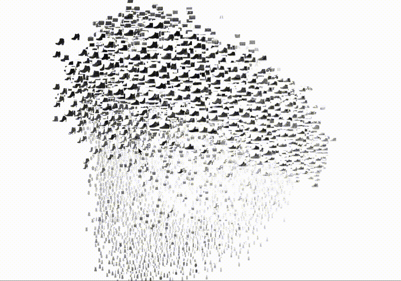

## Домашняя работа №4
Реализовать минимум 5 классификаторов, сравнить метрики между собой, выбрать лучший для Вашего датасета.
Классификаторы:
✓ Классификатор градиентного бустинга. 
✓ Классификатор CatBoost. 
✓ Классификатор Ada Boost. 
✓ Классификатор Extra Trees. 
✓ Квадратичный дискриминантный анализ. 	
✓ Light Gradient Boosting Machine. 
✓ Классификатор K Neighbors.  
✓ Классификатор дерева решений. 
✓ Экстремальный градиентный бустинг.
✓ Фиктивный классификатор.  
✓ SVM - линейное ядро.

# 9. Обучите модель на наборе данных Fashion MNIST для классификации изображений одежды. Сравните результаты с использованием различных классификаторов.

Вот пример того, как выглядят данные:

Список классов (меток):

Each training and test example is assigned to one of the following labels:

| Label | Description |
| --- | --- |
| 0 | T-shirt / top (Футболка / топ) |
| 1 | Trouser (Брюки) |
| 2 | Pullover (Свитер) |
| 3 | Dress (Платье) |
| 4 | Coat (Пальто) |
| 5 | Sandal (Сандалии) |
| 6 | Shirt (Рубашка) |
| 7 | Sneaker (Кроссовки) |
| 8 | Bag (Сумка) |
| 9 | Ankle boot (Ботильоны) |